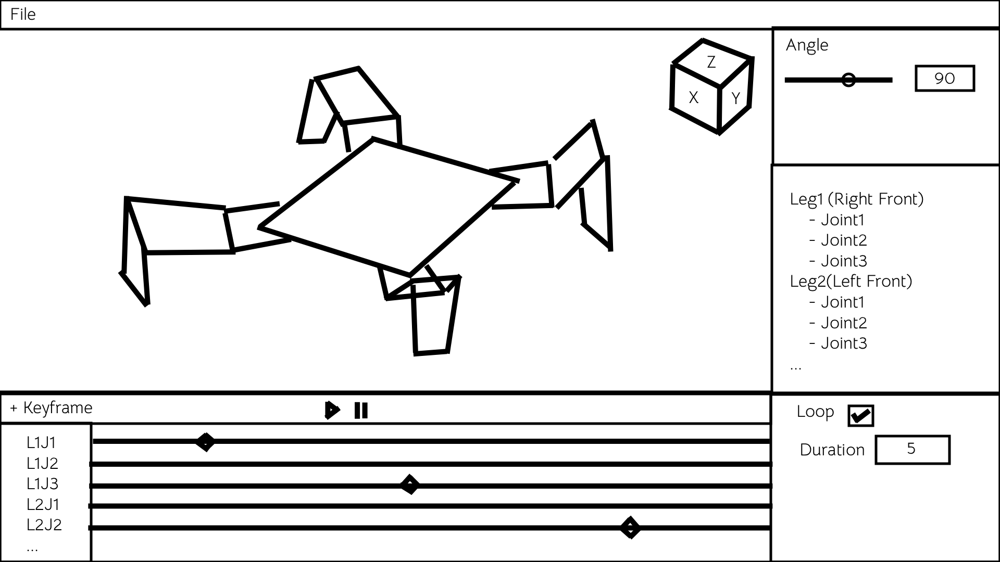

Here is the comprehensive design document (`design_spec.md`) that you can feed into another AI session (or use yourself) to build the application. It covers every aspect of the logic, UI, and architecture without ambiguity.

Image that shows desirable gui look(schematically, without colors and styles):



---

# Technical Design Specification: Spider Robot Gait Editor

## 1. Project Overview

**Goal:** Create a lightweight, fast, and modular Python-based visual editor for designing gait patterns (animations) for a 4-legged spider robot.
**Core Function:** Users can visualize the robot in 3D, manipulate servo angles via sliders or 3D selection, place keyframes on a timeline, and export the resulting animation to JSON.
**Target Workflow:** "Vibecoding" — prioritizing rapid iteration, minimal boilerplate, and high interactivity.

---

## 2. Technology Stack

### Core Frameworks

* **Language:** Python 3.10+
* **GUI & Windowing:** `imgui_bundle`
* *Why:* Contains **Dear ImGui** (UI), **Hello ImGui** (Window/Context management), and **ImGuizmo** (3D View Cube & Gizmos) in a single pip install. It supports docking and fast rendering.


* **3D Rendering:** `ModernGL` (over raw PyOpenGL)
* *Why:* Pythonic wrapper for OpenGL. Easier to manage shaders, Vertex Buffer Objects (VBOs), and Framebuffers for the "Render-to-Texture" view.


* **Math:** `numpy` and `pyglm`
* *Why:* `numpy` for array manipulation; `pyglm` for OpenGL-compatible Matrix/Vector math (Projection, View, Model matrices).


### Dependencies

* `imgui-bundle`
* `moderngl`
* `numpy`
* `pyglm` (or `scipy.spatial.transform` if preferred, but glm is standard for graphics)

---

## 3. Data Architecture

### 3.1 Robot Configuration (`robot_config.json`)

Stores the physical dimensions and mechanical constraints. This file is read-only during the session.

```json
{
  "body": {
    "length_mm": 120.0,
    "width_mm": 120.0,
    "height_mm": 40.0
  },
  "legs": {
    "count": 4,
    "mounting_points": [
      {"id": 0, "name": "FrontRight", "x": 60, "y": 60, "z": 0, "base_rotation": 45},
      {"id": 1, "name": "BackRight", "x": -60, "y": 60, "z": 0, "base_rotation": 135},
      {"id": 2, "name": "BackLeft", "x": -60, "y": -60, "z": 0, "base_rotation": 225},
      {"id": 3, "name": "FrontLeft", "x": 60, "y": -60, "z": 0, "base_rotation": 315}
    ],
    "segments": {
      "coxa_len_mm": 40.0,   // Joint 1 -> Joint 2
      "femur_len_mm": 80.0,  // Joint 2 -> Joint 3
      "tibia_len_mm": 120.0  // Joint 3 -> Tip
    },
    "joints": [
      {"id": 1, "name": "Coxa", "axis": "z", "min": 0, "max": 180},  // Horizontal rotation
      {"id": 2, "name": "Femur", "axis": "y", "min": 0, "max": 180}, // Vertical rotation
      {"id": 3, "name": "Tibia", "axis": "y", "min": 0, "max": 180}  // Vertical rotation
    ]
  }
}

```

### 3.2 Animation Project (`animation.json`)

Stores the timeline data.

```json
{
  "meta": {
    "duration_sec": 5.0,
    "loop": true
  },
  "keyframes": [
    {
      "time": 0.0,
      "servos": {
        "leg0_j1": 90, "leg0_j2": 90, "leg0_j3": 90,
        "leg1_j1": 90, "leg1_j2": 90, "leg1_j3": 90,
        "..." : "..."
      }
    },
    {
      "time": 1.5,
      "servos": {
        "leg0_j1": 45, "..." : "..."
      }
    }
  ]
}

```

---

## 4. Application Logic & Modules

### 4.1 Forward Kinematics (FK)

The app must convert servo angles (0-180) into 3D coordinates to draw the skeleton.

* **Coordinate System:** Z-Up (standard for robotics) or Y-Up (standard for OpenGL). *Decision: Y-Up for OpenGL ease, convert Z-Up data on load.*
* **Calculation Chain (per leg):**
1. Start at `Body Center (0,0,0)`.
2. Translate to `Mounting Point`.
3. Rotate by `Base Rotation` (leg corner angle).
4. **Joint 1 (Coxa):** Rotate around local UP axis (horizontal). Translate `coxa_len`.
5. **Joint 2 (Femur):** Rotate around local RIGHT axis (vertical). Translate `femur_len`.
6. **Joint 3 (Tibia):** Rotate around local RIGHT axis. Translate `tibia_len`.


### 4.2 Playback Engine

* **State:** Holds `current_time` (float).
* **Logic:**
* If `playing == True`: Increment `current_time` by `delta_time`.
* **Loop Handling:** If `current_time > duration`:
* If `loop == True`: `current_time = 0`.
* If `loop == False`: `current_time = duration`; `playing = False`.


* **Interpolation:**
* Find two keyframes surrounding `current_time` (Key A and Key B).
* Calculate factor `t = (current_time - A.time) / (B.time - A.time)`.
* `CurrentAngle = Lerp(A.angle, B.angle, t)`.
* Update the FK model with `CurrentAngle`.


---

## 5. Graphical User Interface (GUI) Layout

The layout uses ImGui Docking.

### 5.1 Main Menu Bar

* **File:**
* `New`: Clears keyframes, resets duration.
* `Open`: Loads JSON into state.
* `Save`: Overwrites current file.
* `Save As...`: Opens file dialog to save JSON.


* **View:** Toggle visibility of panels.

### 5.2 The 3D Viewport Window

A dedicated ImGui window acting as a container for the OpenGL framebuffer.

* **Visuals:**
* Grid floor on XZ plane.
* Robot Body (Box).
* Leg Segments (Lines or Cylinders).
* Joints (Spheres or small Cubes).


* **Controls (Fusion 360 Style):**
* **Orbit:** `Shift` + `Middle Mouse Drag`.
* **Pan:** `Middle Mouse Drag`.
* **Zoom:** `Mouse Wheel`.
* **Selection:** `Left Click` on a joint highlights it and selects the corresponding track in Timeline/Properties.


* **Overlays:**
* **View Cube:** (Top Right) Click faces to snap to Front/Top/Right views (provided by `ImGuizmo`).


### 5.3 The Properties Panel (Right Side)

Shows controls for the currently selected context.

* **Global Section:**
* Slider: `Global Speed` (optional).


* **Leg Control Section:**
* List of Legs (collapsible headers).
* Inside Leg: Sliders for J1, J2, J3.
* *Interaction:* Dragging these sliders updates the "Current Pose" (and modifies the active Keyframe if the playhead is exactly on a keyframe).


### 5.4 The Timeline Panel (Bottom)

* **Header Controls:**
* Button: `Add Keyframe` (Inserts keyframe at current cursor pos with current pose).
* Button: `Play` / `Pause` (Icon toggle).
* Checkbox: `Loop`.
* InputFloat: `Duration` (Total animation time).


* **Timeline Area:**
* **X-Axis:** Time (0s to Duration).
* **Y-Axis:** Rows for each servo (L1J1, L1J2, etc.) or grouped by Leg.
* **Interaction:**
* **Scrub:** Clicking on the top ruler sets `current_time`.
* **Scroll:** Horizontal scrollbar at bottom if Duration > Visible Width. Mouse Wheel scrolls vertically (tracks). `Ctrl + Wheel` zooms time scale.
* **Keyframes:** Represented as Diamonds `♦`.
* *Click:* Select keyframe.
* *Drag:* Move keyframe in time.
* *Right Click:* Delete keyframe.


---

## 6. Implementation Plan & Structure

### Folder Structure

```text
/BobotEditor
│   main.py                 # Application Entry Point & Main Loop
│   config_loader.py        # Parses robot_config.json
│   state_manager.py        # Holds AppState (Animation data, Current Time, Selection)
│
├── /core
│   ├── kinematics.py       # FK math calculations
│   └── playback.py         # Logic for time, looping, and interpolation
│
├── /gui
│   ├── viewport.py         # ModernGL rendering & Framebuffer management
│   ├── timeline.py         # ImGui code for the bottom panel
│   ├── properties.py       # ImGui code for the side panel
│   └── utils.py            # Helpers (Raycasting, Camera Class)
│
└── /resources
    └── robot_config.json   # Physical definition

```

### Development Phases (For the AI Coder)

1. **Skeleton:** Setup `imgui_bundle` window with docking enabled.
2. **Renderer:** Implement `viewport.py` to render a basic grid and a static cube using ModernGL. Map this to an ImGui image.
3. **Kinematics:** Load `robot_config.json`. Implement `kinematics.py` to generate line coordinates based on angles. Draw the "stick figure" robot in 3D.
4. **UI Data Binding:** Connect the sliders in `properties.py` to the angles in `kinematics.py`.
5. **Timeline Logic:** Implement `playback.py`. Create the data structure for Keyframes. Add interpolation logic.
6. **Timeline UI:** Draw the tracks and diamonds. Implement dragging logic.
7. **Interaction:** Add Raycasting to select joints in 3D. Add Save/Load JSON functionality.

## 7. Specific GUI Behaviors to Note

* **Live Preview:** The 3D robot must update *every frame* based on `current_time`. If the timeline is playing, the sliders in the Property panel should visually move (or be greyed out/read-only) to reflect the interpolated values.
* **Editing Mode:** Users usually edit while Paused. If Paused, moving a slider updates the temporary pose. If `Add Keyframe` is clicked, that pose is saved at `current_time`.
* **Timeline Navigation:**
* Left Click on empty space in Timeline Ruler -> Jump playhead.
* Spacebar -> Toggle Play/Pause.